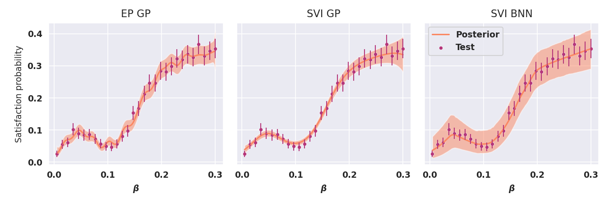
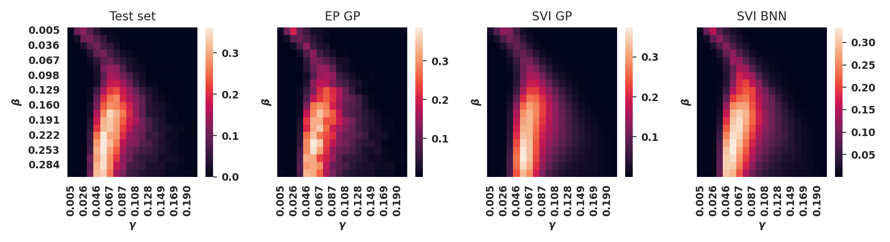
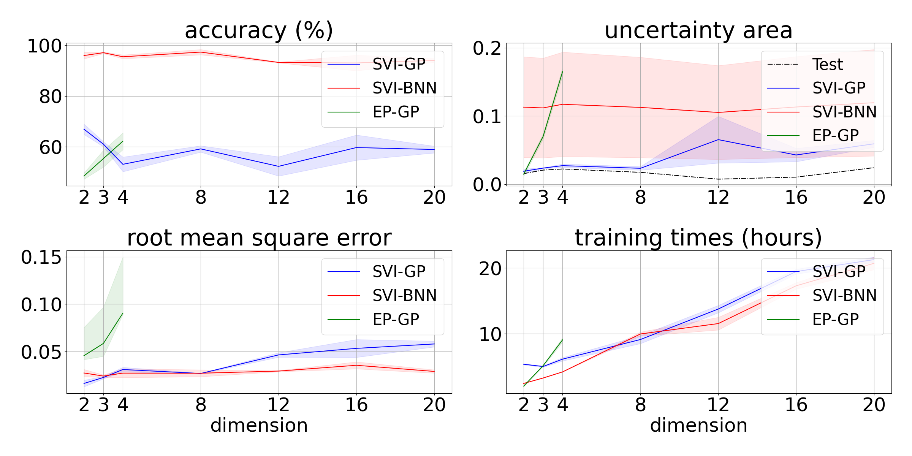

# Scalable and Reliable Stochastic Parametric Verification with Stochastic Variational Smoothed Model Checking

Luca Bortolussi, Francesca Cairoli, Ginevra Carbone, Paolo Pulcini

### Abstract

Parametric verification of linear temporal properties for stochastic models requires to compute the satisfaction probability of a certain property as a function of the parameters of the model. Smoothed model checking (smMC)~\cite{bortolussi2016smoothed} infers the satisfaction function over the entire parameter space from a limited set of observations obtained via simulation. As observations are costly and noisy, smMC leverages the power of Bayesian learning based on Gaussian Processes (GP), providing accurate reconstructions with statistically sound quantification of the uncertainty. 
In this paper we propose Stochastic Variational Smoothed Model Checking (SV-smMC), which exploits stochastic variational inference (SVI) to approximate the posterior distribution of the smMC problem. The strength and flexibility of SVI, a stochastic gradient-based optimization making inference easily parallelizable and enabling GPU acceleration,  make SV-smMC applicable both to  Gaussian Processes (GP) and Bayesian Neural Networks (BNN). 
SV-smMC extends the smMC framework by greatly improving scalability to higher dimensionality of parameter spaces and larger training datasets, thus overcoming the well-known limits of GP. 
Additionally, we combine the Bayesian quantification of uncertainty of SV-smMC with the Inductive Conformal Predictions framework to provide probabilistically approximately correct point-specific error estimates, with statistical guarantees over the coverage of the predictive error. Additionally, we combine the Bayesian quantification of uncertainty of SV-smMC with the Inductive Conformal Predictions framework to provide probabilistically approximately correct point-specific error estimates, with statistical guarantees over the coverage of the predictive error.

## Project structure

- `src/Datasets/` contains the code to generate training and validation sets
    - `Models/` contains the specs of the CRN model and the config setting for the experiments
    - `Data_Generation/` generates dataset of pairs `(pameter, labels)` by generating CRN trajectories with respective STL boolean label. `labels` is a vector of length M of 0s and 1s, where M is the number of samples per parameter value.
    - `Data_Validation/` labels CRN trajectories wrt a STL requirement
    - `Data/WorkingDatasets` contains datasets and visualization plots
- `src/EP_GPs/` implements expectation propagation on Gaussian Processes
- `src/SVI_BNNs/` implements stochastic variational inference on Bayesian Neural Networks
- `src/SVI_GPs/` implements stochastic variational inference on Gaussian Processes

## Setup

Ubuntu version 18.04.06 LTS

Python version 3.7.13

Install virtual environment:
```
cd src/
apt-get install python3.7-venv
python3.7 -m venv venv
pip3.7 install -r requirements.txt
```

## Experiments

Activate the environment
```
source venv/bin/activate
```

### Training and validation datasets

The datasets (training and test) used for the experiments (both biological and random) can be downloaded from the following link:
[https://mega.nz/folder/ZLhRlQ5Q#7NBW57XF5u6bCLReVwYxPQ](https://mega.nz/folder/pbBFnYSJ#XXwzMHfJaV4G9xKx3NMIwg)
and loaded in the `src/data` folder.


To generate new biological datasets update the configuration files `src/DataGeneration/Bio_Data_Generation/*_config.py` and run `python efficient_data_gen.py` with the desired settings.

To generate new random datasets update the configuration files `src/DataGeneration/Random_Data_Generation/*_config.py` and run `python generate_nonconstant_random_dataset.py` with the desired settings for the training set and `python generate_validation_set.py` to generate the corresponding test set. 

### Case studies

`src/bio_settings.py` and `src/settings.py` contains the informations needed to perform training and evaluation on the several case studies.
Comment out the unwanted lines to exclude them from computations.

### Train and evaluate

Train and evaluate EP GP, VI-GPs, SVI GP and SVI BNN models:
```
cd src/
python EP_GPs/train.py
python VI_GPs/train.py
python SVI_GPs/train.py
python SVI_BNNs/train.py
```

Plot final comparisons between the trained models and get summary statistics for biological models:
```
python plot_satisfaction.py
```



To plot the final results of the random case studies run
```
python plot_random_results.py
```



Trained models are saved in `src/out/models/`, executions logs are saved in `src/out/logs/`, plots are saved in `src/out/plots/`, summary statistic are reported in `src/out/plots/evaluation_out_*.txt`.

To reproduce all plots from the paper simply run `./bio_exec.sh` and `./exec.sh`.
